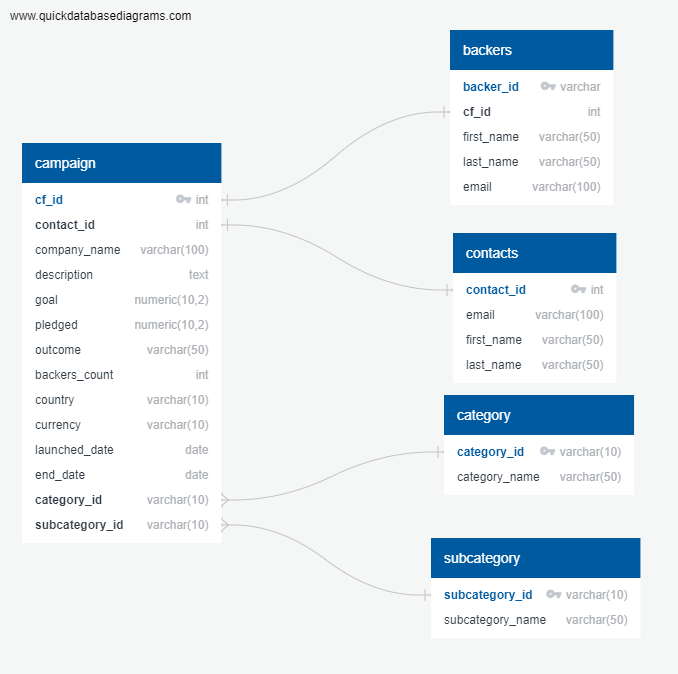

# Crowdfunding-ETL
### Project Overview

Independent Funding, a crowdfunding platform for funding independent projects or ventures, has been growing. Now they are looking to move their data from one large Excel file onto a PostgreSQL database. The main scope of work for this project involves extracting data from an Excel file (into four csv files), transforming data and then loading the data onto a Database.

### Resources
- Date Sources: crowdfunding.xlsx
- Software: PostgreSQL 14.6, pgAdmin4 6.18, Visual Studio Code 1.74.3, Atom 1.63.1

### Results

From the Excel file we were able to pull four csv files (campaign.csv, contacts.csv, category.csv, subcategory.csv.) We identified the primary keys (PK) of each table that was created from the csv files and the foreign keys (FK).

Later on we were provided with a csv file with backer information for each crowdfunding project. We used this to create an additional table within the Database.

### Summary

With all of this data in a Database we were able to manipulate and join tables to create new tables with precise specifications. This allowed us to create a table with the contact information for each crowdfund project how much is left remaining to goal, this way the contacts can be emailed to inform them how close they are to reaching their project goal. In addition, we made a table of backers contact information with which project them backed and how much is remaining to goal, so that the backers can also be emailed to tell them how close (or far) the project is from meeting the goal.
